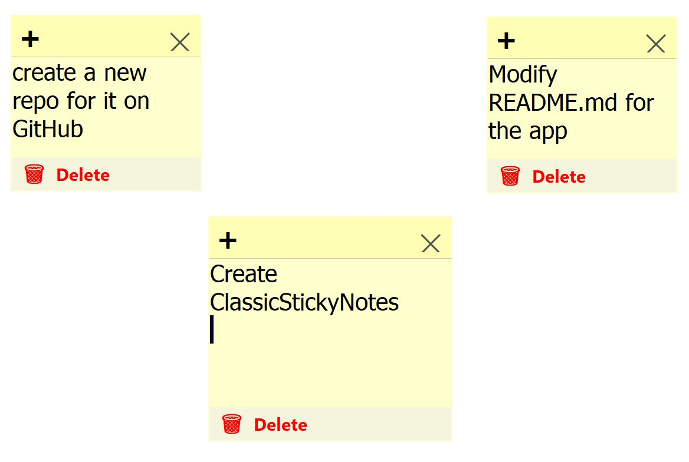
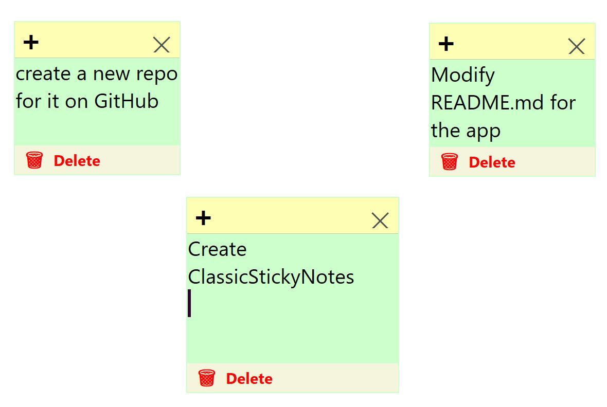

# ClassicStickyNotes 
**Classic Sticky Notes** is a lightweight, **offline‑first** desktop sticky notes app that faithfully revives the beloved Windows XP PowerToy. 
- It runs as a single, portable executable with no installation, no cloud accounts, and no distractions;  just simple, always‑on‑top yellow notes that stay on your desktop (no need to Internet). 
- Customise **colours**, **fonts**, and **sizes** from the system **tray menu**
- Safely **delete** notes with a red confirmation button, and enjoy true single‑instance behaviour. 

This app built with .NET and WinForms, it’s a nostalgic, **privacy‑respecting** tool for anyone who misses the golden age of Windows accessories.

## This archive includes the executable program: **ClassicStickyNotes.exe**, which is suitable for **Windows 10** and over. You should click on the executable to run.
[Download the archive for win64](https://drive.google.com/file/d/157ZAnaqPoFrBKL0YXLzsLS20HrJiehLD/view?usp=sharing)
---

<table>
  <tr>

<td>
Figure 1: A snapshot of the app: ClassicStickyNotes, version 0.0, having two notes.</td>
    
<td>
Figure 2: A snapshot of the app: ClassicStickyNotes, version 0.0, with different settings.</td>

  </tr>
</table>

---